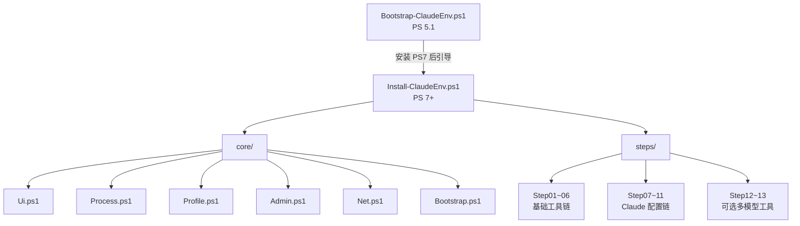

# claude-code-quickstart — AI 上下文索引

> 生成时间：2026-02-20 15:24:29 | 覆盖率：92% (23/25 文件)

Windows 10/11 平台的 **Claude Code 开发环境自动化安装器**。双阶段 PowerShell 架构，PS 5.1 引导 + PS 7 主安装，13 步依赖链，支持断点续传。

---

## 架构速览

```
claude-code-quickstart/
├── installer/
│   ├── Bootstrap-ClaudeEnv.ps1   # PS 5.1 引导入口 → 检测/安装 PS7
│   ├── Install-ClaudeEnv.ps1     # PS 7+ 主安装入口（-Resume/-OneClick/-Staged）
│   ├── core/                     # 6 个基础功能库（Ui/Process/Profile/Admin/Net/Bootstrap）
│   └── steps/                    # 13 个安装步骤模块（Step01~Step13）
└── test-syntax.ps1               # PS7 全量语法校验工具
```



---

## 步骤依赖图

```
Step01.Proxy ─────────────────────────────────────────────────────────
├── Step02.NodeFnm ──────────────────────────────────── Step12.CodexCli [可选]
│   └── Step04.ClaudeCode                              Step13.GeminiCli [可选]
│       ├── Step05.Ccline
│       ├── Step06.CcSwitch
│       └── Step07.ApiKey → Step08.ClaudeConfig ──┬── Step09.ClaudeMd
│                                                  └── Step10.Mcp
└── Step03.Git ─────────────────────────────────── Step11.CcgWorkflow
                                                   (还依赖 Step08.ClaudeConfig)
```

---

## 模块导航

| 模块 | 详细文档 | 职责 |
|------|---------|------|
| installer/ | [installer/CLAUDE.md](installer/CLAUDE.md) | 双入口脚本、安装模式、步骤注册表 |
| installer/core/ | [installer/core/CLAUDE.md](installer/core/CLAUDE.md) | 6 个核心基础库 |
| installer/steps/ | [installer/steps/CLAUDE.md](installer/steps/CLAUDE.md) | 13 个安装步骤模块 |

---

## 关键约束（HC）速查

| 约束 | 内容 |
|------|------|
| **HC-12** | API Key 写入 `~/.claude/settings.json` 的 `env.ANTHROPIC_AUTH_TOKEN` + `env.ANTHROPIC_BASE_URL`；供应商仅限 智谱GLM / MiniMax / Kimi |
| **HC-4** | `$PROFILE` 编辑使用标记块 `# >>> Claude Code Quickstart >>>` / `# <<< Claude Code Quickstart <<<` |
| **HC-3** | 状态文件：`%TEMP%\ClaudeEnvInstaller\install-state.json` |
| **SC-3** | 状态指示器：`[PASS]` / `[FAIL]` / `[SKIP]` |
| **SC-5** | 错误展示：友好信息 + 按 `D` 展开技术详情 |

---

## 关键文件路径

```
~/.claude/settings.json     # Claude Code 主配置（API Key + env + 权限）
~/.claude/CLAUDE.md         # 全局 Claude 工作规范（Step09 写入）
$PROFILE                    # PowerShell 配置文件（ccline/cc-switch PATH）
%TEMP%\ClaudeEnvInstaller\  # 安装状态 + 备份目录
```

---

## 快速调试

```powershell
# 验证全部文件语法
pwsh -File test-syntax.ps1

# 断点续传安装
pwsh -File installer/Install-ClaudeEnv.ps1 -Resume

# 查看步骤列表
pwsh -File installer/Install-ClaudeEnv.ps1 -ListSteps
```
