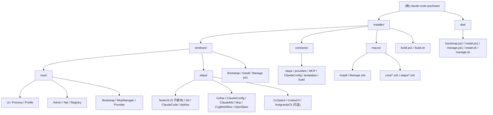

# claude-code-quickstart -- AI 上下文索引

> 生成时间：2026-03-15 | 覆盖率：97% (33/34 文件)

Windows 10/11 与 macOS 12+ 双平台的 **Claude Code 开发环境自动化安装器**。Windows 使用双阶段 PowerShell 架构（PS 5.1 引导 + PS 7 主安装/管理），macOS 使用 zsh + Homebrew + nvm 原生入口；13 步安装依赖链、Manage Skills 管理入口、共享 contracts 契约与实时检测机制。

---

## 架构速览

```
claude-code-quickstart/
├── dist/                             # 默认构建输出：5 个短 artifact
├── installer/
│   ├── build.ps1                     # Windows / GitHub Actions 构建入口
│   ├── build.sh                      # macOS / Unix 本机构建入口
│   ├── contracts/                    # 跨平台步骤、供应商、MCP、配置与模板契约
│   ├── windows/
│   │   ├── Bootstrap-ClaudeEnv.ps1   # Windows PS 5.1 引导入口
│   │   ├── Install-ClaudeEnv.ps1     # Windows PS 7+ 安装入口
│   │   ├── Manage-ClaudeEnv.ps1      # Windows PS 7+ 管理入口
│   │   ├── core/                     # Windows PowerShell runtime core
│   │   └── steps/                    # Windows 13 个安装步骤 + Skills 管理模块（NodeJS 含 5 子模块）
│   └── macos/
│       ├── Install-ClaudeEnv.zsh     # macOS zsh 安装入口（合并 Bootstrap 前置检测）
│       ├── Manage-ClaudeEnv.zsh      # macOS zsh 管理入口
│       ├── core/                     # macOS zsh runtime core
│       └── steps/                    # macOS 13 个安装步骤 + Skills 管理模块
└── test-syntax.ps1                   # Windows PowerShell 语法校验
```



---

## 步骤依赖图

```
NodeJS ─── ClaudeCode ─── ApiKey / Ccline / ClaudeConfig / Mcp
       ├── CcgWorkflow / OpenSpec / CodexCli [可选]
Git (无依赖)    ClaudeMd (无依赖)    CcSwitch [可选, 依赖 ClaudeCode]    AntigravityCli [可选, 无依赖]
```

---

## 模块导航

| 模块 | 详细文档 | 职责 |
|------|---------|------|
| installer/ | [installer/CLAUDE.md](installer/CLAUDE.md) | Windows/macOS 平台目录、contracts 与双构建入口导航 |
| installer/contracts/ | [installer/contracts/README.md](installer/contracts/README.md) | 跨平台步骤、供应商、MCP、ClaudeConfig、模板与构建契约 |
| installer/windows/ | [installer/CLAUDE.md](installer/CLAUDE.md) | Windows canonical 入口、core 与 steps |
| installer/windows/core/ | [installer/windows/core/CLAUDE.md](installer/windows/core/CLAUDE.md) | Windows PowerShell runtime core（含 Registry + McpManager + Provider） |
| installer/windows/steps/ | [installer/windows/steps/CLAUDE.md](installer/windows/steps/CLAUDE.md) | Windows 13 个安装步骤模块 + Skills 管理模块（NodeJS 含 5 子模块，含 Update 函数） |
| installer/macos/ | [installer/macos/README.md](installer/macos/README.md) | macOS zsh Install/Manage、core 与 13 个安装步骤 + Skills 管理模块 |

---

## 关键约束（HC）速查

| 约束 | 内容 |
|------|------|
| **HC-12** | ApiKey 管 API 连接：`env.ANTHROPIC_AUTH_TOKEN` + `env.ANTHROPIC_BASE_URL` + 可选模型环境键（`ANTHROPIC_DEFAULT_HAIKU_MODEL` / `ANTHROPIC_DEFAULT_OPUS_MODEL` / `ANTHROPIC_DEFAULT_SONNET_MODEL`）+ 供应商受管额外 env（如 `ANTHROPIC_MODEL` / `CLAUDE_CODE_SUBAGENT_MODEL` / `CLAUDE_CODE_EFFORT_LEVEL` / `API_TIMEOUT_MS` / Kimi Code 的 `ENABLE_TOOL_SEARCH=false`）+ `providers/` Profile 文件；供应商管理通过 `Manage → 供应商管理` 完成（CRUD + 切换）；ClaudeConfig 管常用配置：语言、权限、超时、归因等（仅补缺失，不覆盖），不写入 `model`（用户自行选择）；供应商支持 智谱GLM / MiniMax / Kimi Code / DeepSeek / 阿里云百炼 / 自定义 |
| **HC-4** | `$PROFILE` 编辑使用标记块 `# >>> Claude Code Quickstart >>>` / `# <<< Claude Code Quickstart <<<` |
| **HC-3** | 实时检测：每次运行都实时检测组件状态，无持久化状态文件 |
| **HC-13** | **PowerShell 数组安全**：`Set-StrictMode -Version Latest` 下，`$null.Count` 会抛异常。接收函数/cmdlet/管道返回值时**必须**用 `@()` 包裹以强制数组上下文（如 `$items = @(SomeFunction)`），禁止裸赋值后直接访问 `.Count`。返回数组的函数应使用 `return ,$array`（逗号阻止展开） |
| **HC-14** | **PS 版本约束**：`installer/windows/Bootstrap-ClaudeEnv.ps1` 兼容 PS 5.1+；`installer/windows/Install-ClaudeEnv.ps1` 和 `installer/windows/Manage-ClaudeEnv.ps1` 及其加载的 `windows/core` / `windows/steps` 模块**仅需兼容 PS 7.0+**，可安全使用 `ConvertFrom-Json -AsHashtable` 等 PS 7 专有特性 |
| **HC-MAC-01** | macOS 入口使用 zsh/bash 脚本体系：首次云端入口 `curl -fsSL <install.sh URL> | bash`，脚本内部自动切换到 `/bin/zsh`；不要求 macOS 用户先安装 PowerShell |
| **HC-MAC-02** | macOS 使用 Homebrew + nvm：最低 macOS 12+，Profile 写入 `~/.zprofile` / `~/.zshrc`，PATH 分隔符为 `:`，禁止在 macOS 代码中调用 winget、注册表、MSI/EXE 或 Windows `$PROFILE` |
| **HC-MAC-03** | Windows 与 macOS 共享 `installer/contracts/` 业务契约与 JSON schema；平台差异只放在 Windows PowerShell runtime 或 macOS zsh runtime 中 |
| **SC-3** | 状态指示器：`[PASS]` / `[FAIL]` / `[SKIP]`，macOS 额外支持 `[UNSUPPORTED]` / `[MANUAL]` 且不计为 Success |
| **SC-5** | 错误展示：友好信息 + 按 `D` 展开技术详情 |

---

## 关键文件路径

```
~/.claude/settings.json     # Claude Code 主配置（供应商 + env + 权限）
~/.claude.json              # Claude Code 初始化标记（hasCompletedOnboarding）
~/.claude/CLAUDE.md         # 全局 Claude 工作规范（ClaudeMd 写入）
~/.claude/rules/ccq-mcp-*.md       # MCP 工具速查（McpManager 动态渲染）
~/.claude/providers/        # 供应商 Profile 目录（ApiKey 写入）
~/.ccq/mcp-meta.json        # MCP Server vault（凭据持久化 + 状态管理）
$PROFILE                    # PowerShell 配置文件（fnm）
%TEMP%\ClaudeEnvInstaller\  # 备份目录（含更新快照 update_* ）
```

---

## 快速调试

### Windows

```powershell
# 验证全部 PowerShell 文件语法
pwsh -File test-syntax.ps1

# 重新运行安装（实时检测，自动跳过已安装组件）
pwsh -File installer/windows/Install-ClaudeEnv.ps1

# 查看步骤列表
pwsh -File installer/windows/Install-ClaudeEnv.ps1 -ListSteps

# 管理 Skills（安装/更新/卸载）
pwsh -File installer/windows/Manage-ClaudeEnv.ps1 -Action Skills

# 管理已安装环境（更新/供应商/MCP/Skills）
pwsh -File installer/windows/Manage-ClaudeEnv.ps1

# 查看可更新步骤
pwsh -File installer/windows/Manage-ClaudeEnv.ps1 -Action Update -ListUpdates
```

### macOS

```sh
# 首次云端安装入口（macOS 12+）
curl -fsSL "https://github.com/MrNine-666/claude-code-quickstart/releases/latest/download/install.sh" | bash

# 从源码运行安装/管理入口
zsh installer/macos/Install-ClaudeEnv.zsh
zsh installer/macos/Manage-ClaudeEnv.zsh

# 查看 macOS 步骤列表
zsh installer/macos/Install-ClaudeEnv.zsh --list-steps

# 查看 macOS 可更新步骤
zsh installer/macos/Manage-ClaudeEnv.zsh --action Update --list-updates

# 构建 macOS 单文件产物
pwsh -File installer/build.ps1 -Platform MacOS
sh installer/build.sh --platform macos

# macOS zsh 语法检查（需在 macOS 或已安装 zsh 的环境运行）
zsh -n installer/macos/Install-ClaudeEnv.zsh
zsh -n installer/macos/Manage-ClaudeEnv.zsh
```
